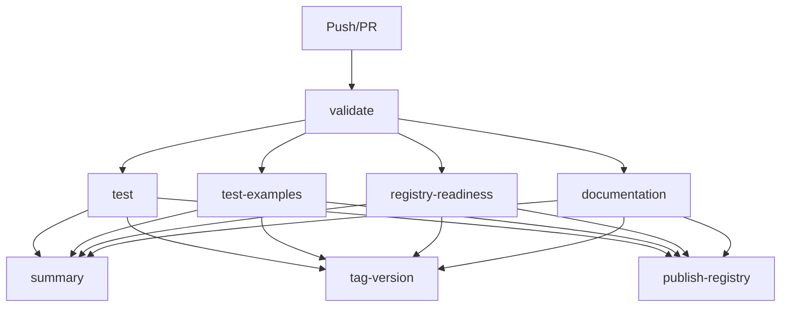

# 🚀 Pipeline GitHub Actions - Melhorias Implementadas

## 📋 O Que Foi Adicionado

### 🧪 **Novos Jobs de Teste**

#### 1. `test-examples` - Teste dos Exemplos
- **Objetivo**: Validar que todos os exemplos funcionam corretamente
- **Escopo**: Testa `single-region` e `multi-region` examples
- **Versões**: Terraform 1.8.0 e 1.9.0
- **Validações**:
  - `terraform init -backend=false`
  - `terraform validate`
  - `terraform fmt -check`
  - `terraform plan` (dry run)

#### 2. `registry-readiness` - Verificação de Prontidão
- **Objetivo**: Garantir que o módulo está pronto para o Terraform Registry
- **Scripts Executados**:
  - `./check-registry-ready.sh` - 23 verificações abrangentes
  - `./validate.sh` - Validação da estrutura e sintaxe

#### 3. `summary` - Resumo da Pipeline
- **Objetivo**: Fornecer visão geral de todos os resultados
- **Status Monitorados**: validate, test, test-examples, registry-readiness, documentation
- **Resultado**: ✅ Sucesso ou ❌ Falha com orientações

### 🔧 **Jobs Melhorados**

#### `tag-version` & `publish-registry`
- **Dependências Atualizadas**: Agora dependem de todos os novos jobs
- **Validação Extra**: Teste final dos exemplos antes da publicação
- **Registry Check Final**: Verificação adicional antes de publicar

#### `publish-registry` - Etapas Adicionais
1. **Registry Check Final**: `./check-registry-ready.sh`
2. **Teste de Exemplos**: Validação de ambos os exemplos
3. **Validação Completa**: Antes de criar o release asset

## 📊 **Fluxo da Pipeline Atualizada**



## ✅ **Verificações Implementadas**

### 🧪 Teste de Exemplos (Matrix Strategy)
```yaml
strategy:
  matrix:
    example: ['single-region', 'multi-region']
    terraform_version: ['1.8.0', '1.9.0']
```
**Total**: 4 combinações testadas

### 🔍 Registry Readiness (23 Verificações)
- ✅ Arquivos obrigatórios (main.tf, variables.tf, outputs.tf, etc.)
- ✅ Estrutura de variáveis com descrições e tipos
- ✅ Outputs com descrições
- ✅ Configuração de versioning
- ✅ Exemplos funcionais
- ✅ Documentação abrangente
- ✅ Pipeline CI/CD configurada
- ✅ Validação Terraform
- ✅ Tags Git com semantic versioning
- ✅ Arquivos desnecessários removidos

### 📝 Validação Estrutural
- ✅ Estrutura de arquivos correta
- ✅ Sintaxe Terraform válida
- ✅ Formatação consistente
- ✅ Módulos e exemplos funcionais

## 🎯 **Benefícios**

1. **🛡️ Maior Confiabilidade**
   - Testes abrangentes antes de qualquer release
   - Validação de exemplos garante documentação funcional
   - Verificações automáticas de compliance com Terraform Registry

2. **🚀 Qualidade Assegurada**
   - 23 verificações automáticas de qualidade
   - Testes em múltiplas versões do Terraform
   - Validação tanto de módulo principal quanto de exemplos

3. **📦 Registry-Ready**
   - Estrutura 100% compatível com Terraform Registry
   - Validação automática antes da publicação
   - Documentação gerada automaticamente

4. **🔍 Visibilidade**
   - Badge de status da CI/CD no README
   - Resumo claro de todos os resultados
   - Logs detalhados para debugging

## 🚦 **Status Atual**

- ✅ **23/23 Verificações OK**
- ⚠️ **1 Aviso**: Apenas falta criar a primeira tag
- ❌ **0 Falhas**

**Resultado**: 🎉 **MÓDULO PRONTO PARA PUBLICAÇÃO!**

## 📋 **Próximos Passos**

1. **Commit das mudanças**:
   ```bash
   git add .
   git commit -m "feat: enhance CI/CD pipeline with comprehensive testing
   
   - Add examples testing with matrix strategy
   - Add registry readiness validation
   - Add comprehensive validation scripts
   - Add pipeline summary with clear status reporting
   - Ensure 100% Terraform Registry compliance"
   ```

2. **Primeiro Release**:
   ```bash
   ./release.sh v1.0.0
   ```

3. **Aguardar Pipeline**: Todos os jobs devem passar ✅

4. **Publicar no Registry**: registry.terraform.io

A pipeline agora garante que **nada quebrado** chegue ao Terraform Registry! 🛡️✨
